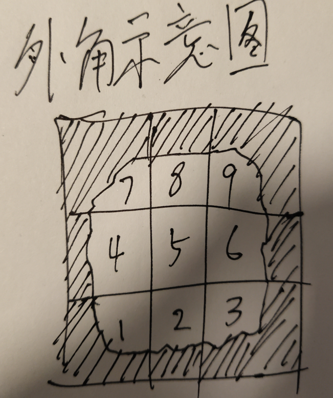
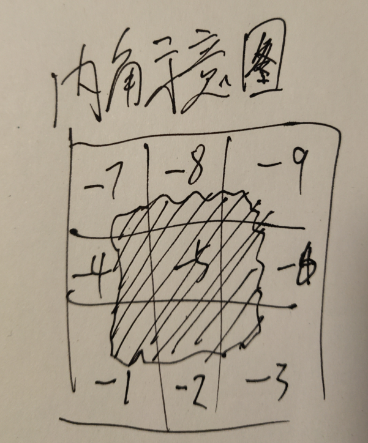

Block Format
```
    {
        "refImgs":["./res/_game/test/red.png"],
         "pieces":[
            {
                "imgIndex":0,
                "x":0,
                "y":0,
                "w":1,
                "h":1
            }
            ],
        "bound":"wall",
        "layer":"forground",
        "displayType":"static",
        "displayPicList":{
            "def":{
                "speed":0,
                "pieces":[0]
            }
        }
    }
```
9宫格地表配置
关键位置
```
"displayType":"autoborder"
"displayPicList":{
    “1”：{
        "speed":0,
        "pieces":[0]
    },
    "2":...,
    "3":...,
    ...
    
}
```
displayType为autoborder,表示九宫格类型地表显示



命名关系为 1 代表左下角图块，2 代表正下方图块， 9 代表右上方图块，
5代表中间图块。

如下
```
7 8 9    左上  正上  右上
4 5 6    正左  正中  正右
1 2 3    左下  正下  右下
```
通常以及无匹配规则时均显示5号图块


靠近地图边缘时，直接显示5号

当一个block相邻的四个格子（只判断当前layer），全是自己同类或者空的block时，才判断外角，否则一律显示5号

其余情况根据规则 判断

当只有上边，右上角，右边，是自己同类格子时，显示1号
```
? y y
0 1 y
? 0 ?

自己的上下左右四个正方向 要么是自己的同类格子（标为y） 要么是空（标为0）
上边右上右边均为同类

其它几个角落无所谓是什么，标为？
此时自己显示为1号图块
```
其余外角规则均可通过上面两图推导
```
? 0 ?    ? 0 ?    0 0 ?   
0 7 y    y 8 y    y 9 0    
? y y    y y y    y y 0    

? y y    y y y    y y ?  
0 4 y    y 5 y    y 6 0
? y y    y y y    y y ?

? y y    y y y    y y 0    
0 1 y    y 2 y    y 3 0    
? 0 ?    ? 0 ?    0 0 ?    
```


1 2 3 4 5 6 7 8 9 九个命名块必选

内角规则可选,没有内角规则时，全部显示5
内角规则如图

```
-7 -8 -9
-4 -5 -6
-1 -2 -3 
```
-5 是不存在的，其余规则如下
```
y  y  y      y  y  y      y  y  y
y -7  y      y -8  y      y -9  y
y  y  0      y  0  y      0  y  y

y  y  y      y  y  y      y  y  y
y -4  0      y  0  y      0 -6  y
y  y  y      y  y  y      y  y  y

y  y  0      y  0  y      0  y  y
y -1  y      y -2  y      y -3  y
y  y  y      y  y  y      y  y  y
```

MapFormat
```
{
    
	"version":"1.0.0",
	"layers":[
		{
            "width":32,
            "height":16,
            "type":"bg",
            "data":[4,2,0,0,0,0,0,0,0,0,0,0,0,0,0,0,0,0,0,0,0,0,0,0,0,0,0,0,0,0,0,0,1,3,0,0,0,0,0,0,0,0,0,0,0,0,0,0,0,0,0,0,0,0,0,0,0,0,0,0,0,0,0,0,0,0,0,0,0,0,0,0,0,0,0,0,0,0,0,0,0,0,0,0,0,0,0,0,0,0,0,0,0,0,0,0,0,0,0,0,0,0,0,0,0,0,0,0,0,0,0,0,0,0,0,0,0,0,0,0,0,0,0,0,0,0,0,0,0,0,0,0,0,0,0,0,0,0,0,0,0,0,0,0,0,0,0,0,0,0,0,0,0,0,0,0,0,0,0,0,4,0,0,0,0,0,0,0,0,0,0,0,0,0,0,0,0,0,0,0,0,0,0,0,0,0,0,0,0,0,0,0,4,0,0,0,0,0,0,0,0,0,0,0,0,0,0,0,0,0,0,0,0,0,0,0,0,0,0,0,0,0,0,0,4,0,0,0,0,0,0,0,0,0,0,0,0,0,0,0,0,0,0,0,0,0,0,0,0,0,0,0,0,0,0,0,4,0,0,0,0,0,0,0,0,0,0,0,0,0,0,0,0,0,0,0,0,0,0,0,0,0,0,0,0,0,0,0,0,0,0,0,0,0,0,0,0,0,0,0,0,0,0,0,0,0,0,0,0,0,0,0,0,0,0,0,0,0,0,0,0,0,0,0,0,0,0,0,0,0,0,0,0,0,0,0,0,0,0,0,0,0,0,0,0,0,0,0,0,0,0,0,0,0,0,0,0,0,0,0,0,0,0,0,0,0,0,0,0,0,0,0,0,0,0,0,0,0,0,0,0,0,0,0,0,0,0,0,0,0,0,0,0,0,0,0,0,0,0,0,0,0,0,0,0,0,0,0,0,0,0,0,0,0,0,0,0,0,0,0,0,0,0,0,0,0,0,0,0,0,0,0,0,0,0,0,0,0,0,0,0,0,0,0,0,0,0,0,0,0,0,0,0,0,0,0,0,0,0,0,0,0,0,0,0,0,0,0,0,0,0,0,0,0,0,0,0,0,0,0,0,0,0,0,0,0,0,0,0,0,0,0,0,0,0,0,0,0,0,0,0,0,0,0,0,0,0,0,0,0,0,0,0,0,0,0,0,0,0,0,0,0,0,0,0,0,0,0,0,0,0,0,0,0,0,0,0,0,0,0,0,0,0,0,0,0,0,0,0,0,0,0,0,0,0,0,0,0,0,0,0,0,0,0,0,0,0,0,0,0,0,0,0,0,0,0,0,0,0,0,0,0,0,0,0,0,0,0,0,0,0,0,0,0,0,0,0,0,0,0,0,0,0,0,0,0,0,0,0,0,0,0,0,0,0,0,0,0,0,0,0,0,0,0,0,0,0,0,0,0,0,0,0,0,0,0,0,0,0,0,0,0,0,0,0,0,0,0,0,0,0,0,0,0,0,0,0,0,0,0,0,0,0,0,0,0,0,0,0,0,0,0,0,0,0,0,0,0,0,0,0,0,0,0,0,0,0,0,0,0,0,0,0,0,0,0,0,0,0,0,0,0,0,0,0,0,0,0,0,0,0,0,0,0,0,0,0,0,0,0,0,0,0,0,0,0,0,0,0,0,0,0,0,0,0,0,0,0,0,0,0,0,0,0,0,0,0,0,0,0,0,0,0,0,0,0,0,0,0,0,0,0,0,0,0,0,0,0,0,0,0,0,0,0,0,0,0,0,0,0,0,0,0,0,0,0,0,0,0,0,0,0,0,0,0,0,0,0,0,0,0,0,0,0,0,0,0,0,0,0,0,0,0,0,0,0,0,0,0,0,0,0,0,0,0,0,0,0,0,0,0,0,0,0,0,0,0,0,0,0,0,0,0,0,0,0,0,0,0,0,0,0,0,0,0,0,0,0,0,0,0,0,0,0,0,0,0,0,0,0,0,0,0,0,0,0,0,0,0,0,0,0,0,0,0,0,0,0,0,0,0,0,0,0,0,0,0,0,0,0,0,0,0,0,0,0,0,0,0,0,0,0,0,0,0,0,0,0,0,0,0,0,0,0,0,0,0,0,0,0,0,0,0,0,0,0,0,0,0,0,0,0,0,0,0,0,0,0,0,0,0,0,0,0,0,0,0,0,0,0,0,0,0,0,0,0,0,0,0,0,0,0,0,0,0,0,0,0,0,0,0,0,0,0,0,0,0,0,0,0,0,0,0,0,0,0,0,0,0,0,0,0,0,0,0,0,0,0,0,0,0,0,0,0,0,0,0,0,0,0,0,0,0,0],
			"refblocks":["hash1","hash2","hash3","hash4"]
		}
    ]
}
```