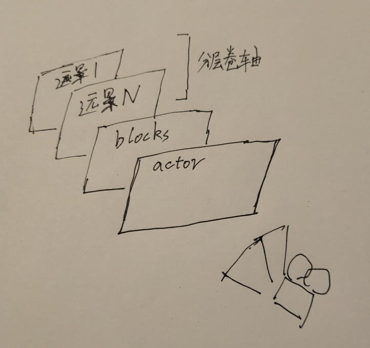
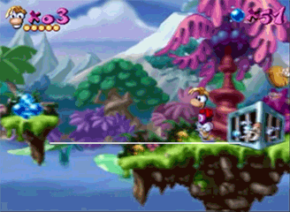
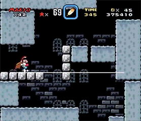
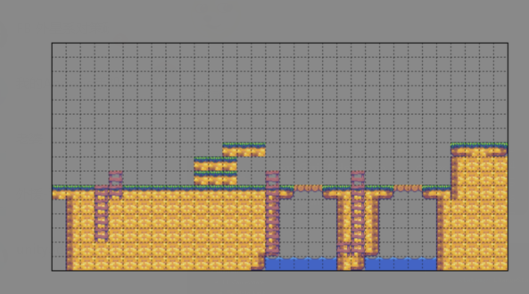
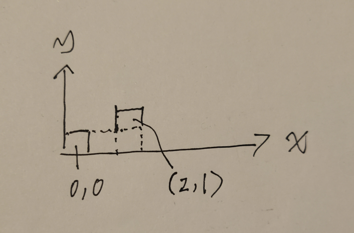
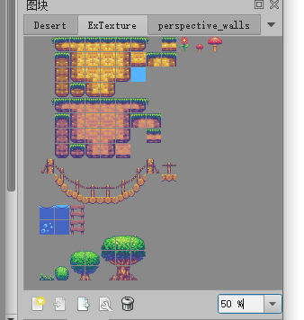
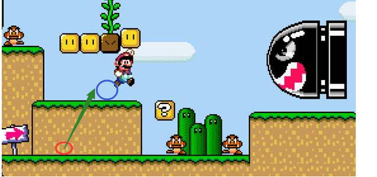
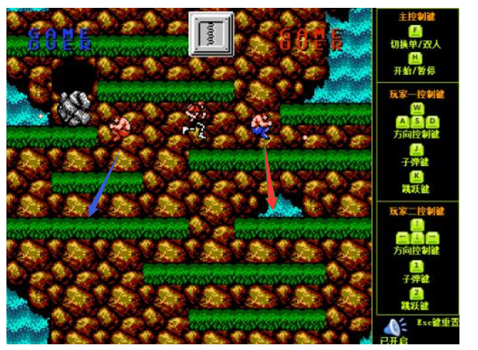

# 地图系统

## 层
本案是一个2D游戏系统，他表现出来是平面的绘制模式

从摄像机角度看过去，首先看到是Actor层，然后是Block层，远景N....依次到远景2 远景1

严格的讲Actor 前面可能还会有视觉特效层 和 UI层

但视觉特效和UI均不在地图系统讨论范畴内，故此处不讨论

如图所示

### 远景层（1~N）
远景层是多个就是运用被广泛称为分层卷轴的技术

如雷曼游戏中远处的山 和 云，你会发现他们也是随镜头移动的，但却和主角的移动速度不同

那么可能是山是远景2，运动比较慢

云是远景1，运动最慢

分层卷轴技术就是运用这个运动速度的差异，而产生出令人信服的远景近景的区分

本案就采用分层卷轴技术，允许最多16层远景（实际上两层就可以产生丰富的远景细节）

### Blocks层
本案的近景层，就是和角色互动的砖块这些东西，因为他是一块一块构成的，所以叫做blocks层
mario 的block层 看起来就比较方

但其实还要方

无论你看到的地图是什么样子，横板游戏有很多都是采取这种均匀的小方格来构成的

本案就采用这种均匀小方格构成的方法

因为blocks层是地图系统的灵魂，所以我们接下来交代系统，只要没有特别说明，都是针对blocks层来进行说明

构成地图的一个小方格就是构成地图的基本元素，有很多叫法 grid tile block quad seed，本案确定叫做block，如果本案文档中说到格子，小方格，地图元素，指的都是这个block。

### Actor层
Actor层是用来展示活动物体的层，比如玩家角色，各种NPC，子弹、金币之类的内容
他和blocks层 显示上是重合 ，逻辑上有交互

actor层的更多细节，也不属于地图系统的内容，将另行说明

## 坐标系

本案的地图系统是

以格子为单位的2D坐标系

左下角（0，0），且从（0，0）开始，不存在负值

第一个格子为（0，0），他右侧的格子为（1，0）

如图所示

每一个格子绘制出来为一个图片，限制格子为正方形，且格子使用的图片的尺寸是
2^N(N为正整数)

意即 2x2 4x4 8x8 16x16 32x32 64x64 128x128 都是合法的图片尺寸

选这个尺寸也是考虑到gpu硬件的一些特性，其实当然可以是 24 18 这些比较奇异的尺寸。

这张图使用的是32x32的元素尺寸

考虑到硬件兼容性，单张贴图最大容量限制2048*2048
最大贴图下，使用128x128的 格子图片时，一张贴图最多放置256个元素
而2048*2048，如果地图要搞得花里胡哨的话，这还是比较紧张的
而实际为了有差不多的表现力 8x8 及一下基本没有用

最为常用的三个block尺寸实际上是 

**16x16 32x32 64x64**

所以我们就设定 只使用这三个 尺寸
16x16 大概就是马里奥早期那个清晰度水准，32x32细致一点，64x64最细

## 地图元素
blocks层的地图元素 

### 依据其像素尺寸，可分为 16 32 64 三种

前文已述

### 依据其和角色的碰撞关系特性，可分为 穿透、遮挡物、平台

穿透，角色可以无视这个block，直接走过去

遮挡物就是会挡住角色的地形比如墙、地面

平台比较特殊，他就是一种可以横向可以穿透，纵向跳跃上去可以站立的特殊地形

比如超级马里奥3中，马里奥可以从红色点跳到蓝色点并不掉下来，但是他一路从红色平面往前走却不会被挡住

根据不同的游戏，有些游戏只能上平台，不能下平台，比如超级玛丽奥3，只能从红到蓝，不能从蓝到红

魂斗罗是可以的，他有下跳这个动作，爬下按跳，可以下平台

### 依据其绘制顺序可分为 背景 前景（背景前景都属于近景） 并具有不同优先级

如图，蓝色部分为远景，绿色部分为前景，红色部分为背景

## 地图元素的自动布置

还是以马里奥为例，平台就有平台顶，平台墙面，平台顶左圆角，平台顶右圆角 四种元素构成
这在定义地图时就得为了平台定义四个元素

本案中不采用这种做法，我们在地图元素的定义时，对这种元素统一定义为“平台”一种
地图保存数据时，也只保存该坐标位置为平台

在绘制地图时，自动判断该使用哪一种

其实，这是一个九宫格系统，将在地图存储格式和绘制方法中详述