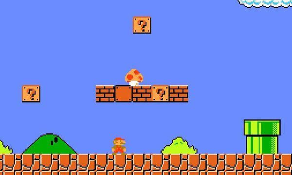

# olio.blockstaff

## 简述

olio 是一个新的UGC游戏内容（User Generated Content）方面的品牌（暂定名）

blockstaff 是我们的第一个项目，他的画面表现形式基调是像马里奥制造、泰拉瑞亚

## 游戏说明

olio.blockstaff
是一款2D的、具有高自由度的，玩家可以参与游戏制作的，具有区块链经济系统的游戏。
游戏的核心玩法是玩家制造自己的冒险世界供其它玩家游玩。

为介绍方便，本文后称 bs 或本游戏，或olio，因为在系统方面，我们尽可能将他设计的通用，并不止适用于此游戏，大部分的系统都是olio品牌通用。

游戏采用html5技术制作，可在网页上运行

## 游戏基本观念
olio的游戏世界观

### 大厅世界

大厅世界相当于自己的家，家里可以放一些传送门，进入传送门就可以进入各式各样的冒险世界。

### 冒险世界

冒险世界就是一个又一个的关卡，玩家可以在这里一次次死亡、复活，勇者斗恶龙或者打飞机。

你可以把他理解为脑后插管

大厅世界相当于和平的现实世界，冒险世界就是一场场梦中的冒险

### 角色

olio玩家会始终操作一个角色，基本的操作是 摇杆+按键 模式

会在不同设备做出适配，pc是键盘+鼠标或者摇杆，移动设备是触摸屏虚拟摇杆

olio的冒险世界可以用来开发各种操作一个角色的游戏

### 背包

olio玩家会有一个背包，里面是自己所拥有的各种各样的道具和材料。

当进入冒险游戏时，这个背包会被锁定，仅有当前冒险游戏允许使用的道具可见

在冒险游戏中捡到的道具大部分都是临时的，结束游戏不会存在。

只有游戏作者设置的奖励，取得后会永久存在于背包中。

## 游戏入口

### url入口

olio是一款多入口的游戏

分为一个大厅世界 对应多个冒险世界

每一个玩家都可以建立自己的大厅世界和自己的多个冒险世界。

每一个玩家都可以获得一个url，直接打开自己的大厅世界。

玩家可以将自己制作的冒险世界设为公开，也可以得到一个直接进入冒险世界的url。

### 应用入口

我们也会发布打包器，玩家可以生成直接进入自己的大厅世界或冒险世界的 exe，apk，ipa 等

让玩家发布自己专属的 pc应用和移动应用

### 社交入口

还有一种入口方式是你在一个大厅遇到另一个玩家，添加为好友，以后你可以在任何地方，通过社
交功能，选择去好友的家（他的大厅世界）或者他公开的某个冒险世界

### 官方入口

官方会建设一个大厅世界和若干冒险世界，但和玩家建设的完全具有相同的基础，主要用于展示游
戏新功能

提供url入口和应用入口

## 商店

有两种类型的商店

一是拍卖场，拍卖场是全局的，任何地方都可以通过菜单进入，由官方运营
也可摆放传送门打开

二是商店，商店是每个玩家都可以设置的，需要在大厅世界或者冒险世界里摆一个道具打开

玩家需要在商店里放置道具设置价格

放置在冒险世界中的商店可以店出售冒险临时道具和永久道具

放置在大厅世界中的商店只出售永久道具

## 创造

玩家可以创造大厅世界、冒险世界（建筑）
可以创造世界中摆放的道具，可以通过功能道具制作出机关、陷阱
可以创造角色形象、音乐、音效、NPC、载具

玩家创造的道具可以集成大量的心血和时间，所以道具可以销售。
同时为了减少浪费，采取一个图纸/配方的设计

玩家创造了一个道具以后，可以采用配方工具，将该道具的配方变成一个道具。
配方道具可以复制。可以用配方和材料直接合成出配方所对应的道具

一个道具分为（手作/原版/量产/改造）四种状态
一个刚拼出来的道具处于手作状态，对手作可以配方化，配方化以后的手作道具变为原版，无法再次配方化，也无法进行修改。
用配方和材料合成出来的道具称为量产
对量产道具再次进行修改就变成了改造状态
对改造道具可以配方化，此时改造道具也变为原版，改造道具会多出继承属性，知道是基于哪个配方。改造道具得到的配方也有继承属性，知道是基于哪个配方

对于配方可以申请专利，这样当别人仿制的时候，可以申请裁判。会通过一个分布式投票系统进行管理，判定为侵权的配方与相关道具都会大大的显示“盗版”字样，并显示原版相关信息。

创造主要的机制是通过olio的电路系统，在系统说明中另行详述。

## 经济机制

解释olio的经济机制

[经济机制](doc/economic/main.md)

## 分系统说明

### 地图系统

解释olio的地图系统

[地图系统文档](doc/map/system.md)

[地图系统数据格式](doc/map/format.md)

### 电路系统

解释olio的电路系统，olio的电路系统用于让玩家来开发各种各样的道具
相当于一种无需编程的语言

[电路系统](doc/building/main.md)

### 替身系统

解释bs 的 替身系统，替身系统用于更换玩家操作角色

比如我的冒险地图是个飞机大战，玩家在这个冒险地图中扮演的是一架飞机。
那么玩家在进入这个冒险地图时就需要选择自己的替身

默认的角色只有很少的动作 移动 蹲下 跳跃 互动 挥舞武器。
我的冒险地图是一个动作游戏，如果想设计一个具有复杂动作的角色，也可以使用替身系统

## 开发进度

管理追踪olio的开发情况
[开发文档](doc/process/start.md)

